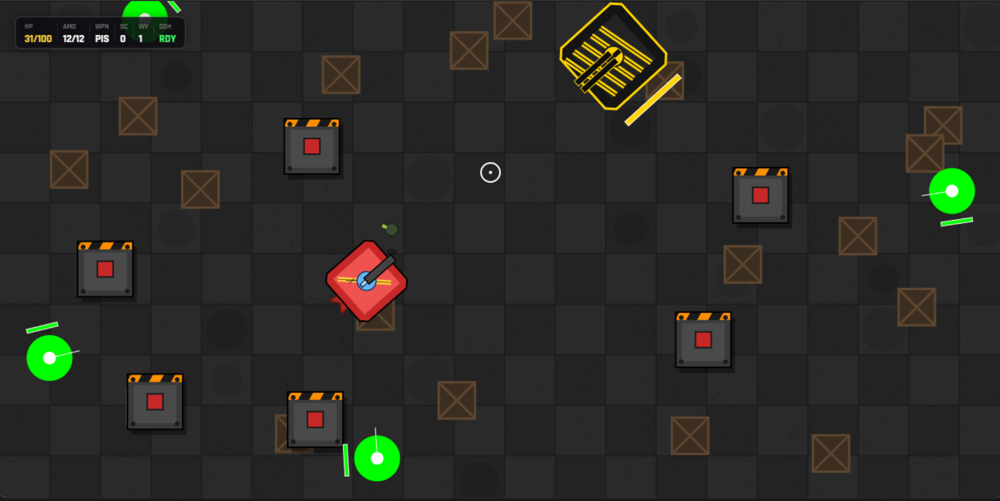

  

# 🎮 Surrounded

A fast-paced 2D survival shooter built entirely with vanilla JavaScript and HTML5 Canvas.

## About

**Surrounded** is a survival shooter where you're dropped into an arena with one objective:

> **Stay alive.**

Enemies never stop hunting you, every second becomes more chaotic, and survival depends on movement, positioning, and quick reactions.

But something else is watching.

A mysterious entity appears before the fight truly begins, only to disappear without explanation. As you survive longer, its presence becomes harder to ignore. Each encounter raises more questions than answers, building toward a confrontation you'll only understand if you manage to survive long enough.

There are no levels to select, no checkpoints, and no hints about what's waiting ahead.

**Just survive.**

---

## Features

- 🎯 Custom game engine built from scratch
- 🕹️ Smooth player movement
- 👾 Dynamic enemy AI
- 👑 A mysterious recurring boss encounter
- 🔫 Multiple weapon system
- 💣 Grenade ability
- ❄️ Freeze ability
- ⚡ Dash mechanic
- 💥 Collision detection system
- ❤️ Health system
- 🎨 Modern in-game HUD
- 🌍 Procedurally generated world
- 📷 Camera-based gameplay
- ✨ Visual effects and gameplay polish
- ⚡ Optimized rendering loop

---

## Tech Stack

- HTML5
- CSS3
- JavaScript (ES6)
- HTML5 Canvas API

No external game engine was used.

---

## Development Journey

The game's core engine, rendering pipeline, movement, combat mechanics, and gameplay systems were built from scratch through an iterative development process with guidance from ChatGPT.

After establishing the foundation, the project underwent multiple rounds of refinement and polish with assistance from both ChatGPT and Claude. This included improving gameplay feel, visuals, user interface, balancing, optimization, and the overall player experience.

Rather than relying on an existing engine, **Surrounded** was developed as a custom-engine project to better understand how 2D games work under the hood.

---

## Learning Outcomes

Building **Surrounded** provided hands-on experience with:

- Game loops
- Entity management
- Rendering pipelines
- Camera systems
- Collision detection
- Enemy AI
- Boss state management
- Weapon systems
- Ability systems
- Procedural world generation
- Performance optimization
- Game architecture
- UI/HUD development

---

## Controls

| Key           | Action              |
|---------------|---------------------|
| **W A S D**   | Move                |
| **Mouse**     | Aim                 |
| **Left Click**| Shoot               |
| **Shift**     | Dash                |
| **R**         | Reload              |
| **G**         | Throw Grenade       |
| **F**         | Freeze Ability      |
| **1 / 2 / 3** | Switch Weapon       |
| **Esc**       | Pause               |
| **M**         | Mute / Unmute Music |
| **H**         | Cycle HUD Style     |

---

## Future Ideas

- Additional weapons
- More enemy variants
- New abilities
- Expanded boss mechanics
- Particle effects
- Original soundtrack & SFX
- Difficulty modifiers
- Achievements
- Mobile support

---

## Acknowledgements

Created by **Abhinav Singh**.

The custom game engine, rendering systems, and gameplay mechanics were developed through an iterative design and implementation process with guidance from ChatGPT. The later stages of gameplay refinement, optimization, balancing, UI improvements, and visual polish were completed with the assistance of both ChatGPT and Claude.

---

## License

This project is open for learning and inspiration.

Please do not redistribute or claim the work as your own without permission.
